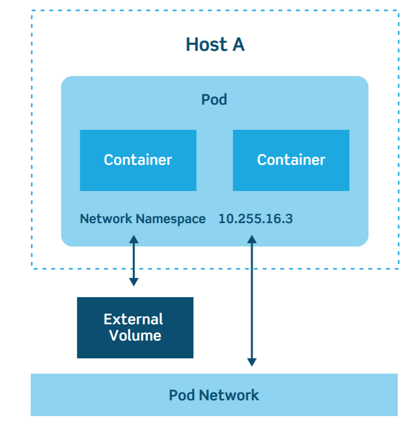
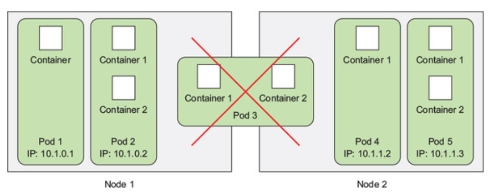
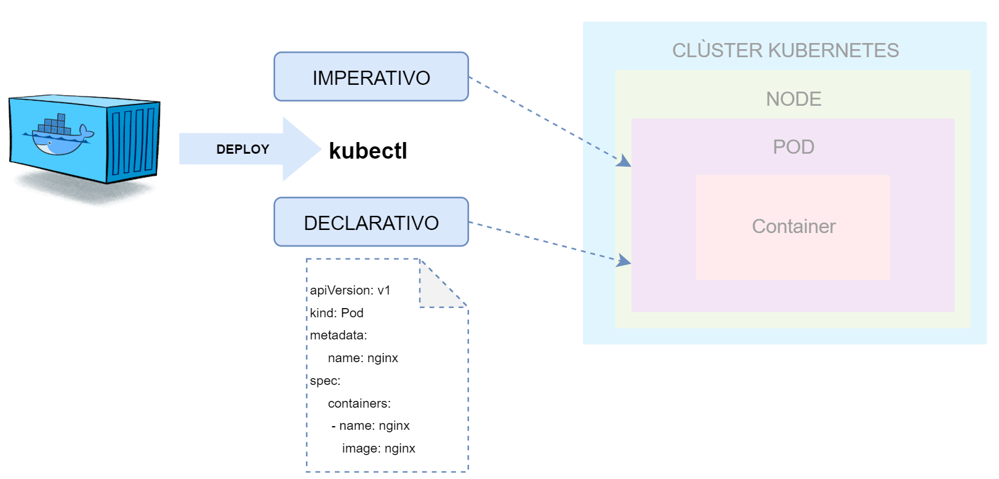

# ¿Qué es un Pod?

## Requisitos

`git clone https://github.com/vthot4/kubernetes_101_lab.git`{{execute}}

`cd kubernetes_101_lab/`{{execute}}

`chmod +x environment.sh`{{execute}}

`./environment.sh`{{execute}}

`cd`{{execute}}

Comprobamos que todo esta correcto:

`minikube status`{{execute}}


Abrimos Octant. Para acceder, seleccionaos en la parte superior del terminal web, pulsar sobre el signo mas y luego pulsar en "Select port to view on Host 1". Escribir 8900, y luego pulsar "Display Port".


## Introducción

Los **Pods** son unos de los conceptos más importantes en Kubernetes, ya que son los objetos claves con los que interactúan los desarrolladores.  Un Pod será la unidad de ejecución básica de una aplicación Kubernetes, la unidad más pequeña y simple en el modelo de objetos que crea o implementa Kubernetes. El Pod encapsula el contenedor (ó contenedores) de una aplicación junto con los recursos de almacenamiento, red y las reglas de ejecución.   

El diagrama de arquitectura de un Pod queda reflejado en el siguiente esquema:



Una característica interesante de los Pods es que son efímeros, con una vida útil normalmente limitada. Al reducir el escalado o actualizar a una nueva versión, los Pods mueren. Es una idea que tenemos que tener clara, cuando un Pod falla o cambia, todo lo que contenía desaparece por lo que nos debemos de apoyar en herramientas externas para poder hacer análisis de *"root cause"* .

Existen dos tipos de modelos de Pod que podemos crear:

- **Un contenedor por Pod.**  Es el modelo habitual y nos proporciona un alto desacoplamiento de los diferentes servicios por lo menos a nivel operacional.

- **Multi-contenedor por Pod.** En este modelo, un Pod puede contener múltiples contenedores que suelen estar estrechamente acoplados para compartir recursos. Estos contenedores funcionan como una sola unidad de servicio. Un ejemplo puede ser el uso de sidecars, proxies o registros. Al ser una unidad de servicio, los contenedores siempre tiene que correr en el mismo nodo.

  

  

A la hora de desplegar el Pod en el clúster de Kubernetes podemos optar por una vía imperativa en la que lo desplegamos directamente o declarativa mediante un fichero tipo **yaml** en el que le decimos al clúster como queremos que despliegue nuestro Pod. La primera opción suele estar bien para entornos de desarrollo pero no es buena opción para producción. 



## Desplegando nuestro primer Pod.

Comenzamos desplegando nuestro primer Pod de forma imperativa, simplemente usando el modificador **"run"** de la siguiente forma:

`kubectl run webserver --image=nginx`{{execute}}

Vemos en la salida, que esta forma de ejecutar un Pod está en *DEPRECATED* ya que la opción que usa por defecto no sólo nos esta creando un Pod sino que lo esta asociando a un Deployment. Una entidad superior a la que le podemos aplicar otro tipo de controllers orientados a especificar el comportamiento sistémico del Pod dentro de nuestro clúster.

Podemos ver el Pod que hemos creado y  el deployment mediante:

`kubectl get pods`{{execute}}

`kubectl get deployments`{{execute}}

`kubectl get po,deploy`{{execute}}

Si queremos ver información más detallada usaremos el modificador *"-o wide":

`kubectl get pods -o wide`{{execute}}

Imaginemos que no queremos que nos genere el Deployment y simplemente queremos que nos despliegue el Pod. Para ello usaríamos la siguiente sintaxis:

`kubectl run --generator=run-pod/v1 webserver2 --image=nginx`{{execute}}

Comprobamos que lo ha hecho correctamente:

`kubectl get pods`{{execute}}

`kubectl get deployments`{{execute}}

Una buena forma de ver la diferencia entre los dos tipos de despliegue es probar a borrar los pods. En el caso del que tiene un deployent asociado, veremos como se reinicia y en el otro simplemente se para. 

```bash
kubectl delete pod $NAME
```

