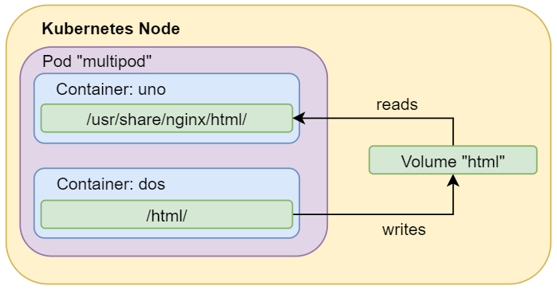

# Multi contenedores en un Pod.

## Requisitos

`git clone https://github.com/vthot4/kubernetes_101_lab.git`{{execute}}

`cd kubernetes_101_lab/`{{execute}}

`chmod +x environment.sh`{{execute}}

`./environment.sh`{{execute}}

`cd`{{execute}}

Comprobamos que todo esta correcto:

`minikube status`{{execute}}


Abrimos Octant. Para acceder, seleccionaos en la parte superior del terminal web, pulsar sobre el signo mas y luego pulsar en "Select port to view on Host 1". Escribir 8900, y luego pulsar "Display Port".


## Introducción.

Los contenedores a menudo están destinados a resolver un problema único y definido de manera limitada, como un microservicio, pero en el mundo real, los problemas requieren múltiples contenedores para una solución completa.

El propósito principal de un Pod multi-contenedor es admitir procesos auxiliares co-ubicados y co-administrados para una aplicación primaria. Existen algunos patrones generales para usar procesos auxiliares en Pods:

- **Sidecars containers.** Normalmente destinas a ayudar al contenedor principal
- **Proxies,bridges,and adapters.** Normalmente conectan el contenedor principal con el mundo externo. Por ejemplo, el servidor Apache HTTP o nginx puede servir archivos estáticos. También puede actuar como un proxy inverso a una aplicación web en el contenedor principal para registrar y limitar las solicitudes HTTP. Otro ejemplo es un contenedor auxiliar que redirige las solicitudes del contenedor principal al mundo externo.


## Desplegando un Pod multi container.

El ejemplo que vamos a desplegar es el siguiente compuesto de dos containers. Uno con nginx y otro con Apache. El esquema es el siguiente:



En este ejemplo, definimos un volumen llamado html . Su tipo es emptyDir , lo que significa que el volumen se crea por primera vez cuando se asigna un Pod a un nodo, y existe mientras ese Pod se esté ejecutando en ese nodo. Como su nombre lo dice, inicialmente está vacío. El primer contenedor ejecuta el servidor nginx y tiene el volumen compartido montado en el directorio / usr / share / nginx / html . El segundo contenedor usa la imagen de Debian y tiene el volumen compartido montado en el directorio / html . Cada segundo, el segundo contenedor agrega la fecha y hora actuales al index.htmlarchivo, que se encuentra en el volumen compartido. Cuando el usuario realiza una solicitud HTTP al Pod, el servidor Nginx lee este archivo y lo transfiere al usuario en respuesta a la solicitud.

En el siguiente yaml podemos ver el despliegue que vamos a hacer.

```yaml
apiVersion: v1
kind: Pod
metadata:
  name: multipod
spec:
  volumes:
  - name: html
    emptyDir: {}
  containers:
  - name: uno
    image: nginx
    volumeMounts:
    - name: html
      mountPath: /usr/share/nginx/html
  - name: dos
    image: debian
    volumeMounts:
    - name: html
      mountPath: /html
    command: ["/bin/sh", "-c"]
    args:
      - while true; do
          date >> /html/index.html;
          sleep 1;
        done
```

Como en el caso anterior, vamos a hacer el despliegue con el modificador "create":

`kubectl create -f kubernetes_101_lab/pod/lab1/multipod.yaml`{{execute}}

Comprobamos el estado de los Pods:

`kubectl get pods`{{execute}}

Comprobamos las características del despliegue:

`kubectl describe multipod`{{execute}}

Comprobamos que funciona correctamente mediante:

`kubectl exec multipod -c uno -- /bin/cat /usr/share/nginx/html/index.html `{{execute}}

`kubectl exec multipod -c dos -- /bin/cat /html/index.html`{{execute}}

Borramos el Pod

`kubectl delete pod multipod`{{execute}}

`kubectl get pods`{{execute}} 