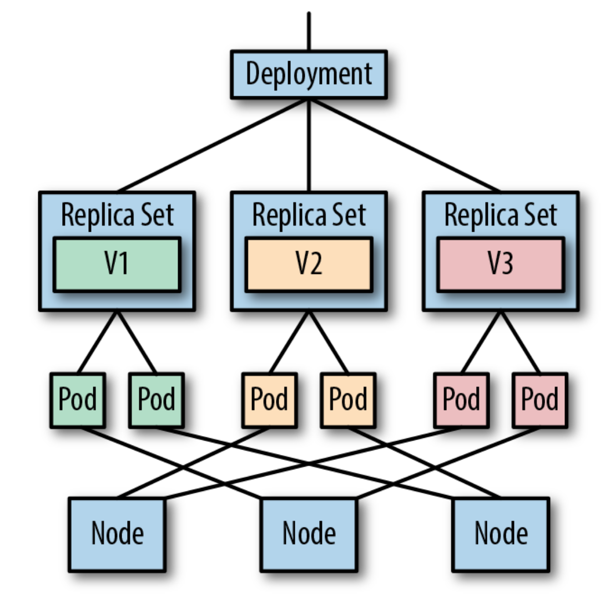

# Deployment


## Requisitos

`git clone https://github.com/vthot4/kubernetes_101_lab.git`{{execute}}

`cd kubernetes_101_lab/`{{execute}}

`chmod +x environment.sh`{{execute}}

`./environment.sh`{{execute}}

`cd`{{execute}}

Comprobamos que todo esta correcto:

`minikube status`{{execute}}


Abrimos Octant. Para acceder, seleccionaos en la parte superior del terminal web, pulsar sobre el signo mas y luego pulsar en "Select port to view on Host 1". Escribir 8900, y luego pulsar "Display Port".


## Introducción

El **Deployment** es la unidad de más alto nivel que podemos gestionar en Kubernetes. Entre otras cosas, nos permite definir diferentes funcoines, como:

- Control de replicas.
- Escalabilidad del Pod.
- Actualizaciones continuas.
- Despliegues automáticos.
- Roolbacks a versiones anteriores.




## Creando nuestro primer deployment.

En el siguiente ejemplo vamos crear un deployment que nos permitirá desplegar una imágen de Docker nginx:1.7.9

```yaml
apiVersion: apps/v1
kind: Deployment
metadata:
  name: nginx-deployment
spec:
  selector:
    matchLabels:
      app: nginx
  replicas: 2 # indica al controlador que ejecute 2 pods
  template:
    metadata:
      labels:
        app: nginx
    spec:
      containers:
      - name: nginx
        image: nginx:1.7.9
        ports:
        - containerPort: 80
```

Podemos verlo en la máquina:

`cat kubernetes_101_lab/deplyment/lab1/deployment.yaml`{{execute}}

Desplegamos el deployment mediante: 

`kubectl apply -f kubernetes_101_lab/deplyment/lab1/deployment.yaml`{{execute}}

Vemos la información asociada al deployment:

`kubectl get deploy`{{execute}}

Comprobamos el estado del replicaset:

`kubectl get rs`{{execute}}

Un ReplicaSet se define mediante campos, que incluyen un selector que especifica cómo identificar los Pods que puede adquirir, una cantidad de réplicas que indica cuántos Pods debería mantener y una plantilla de pod que especifica los datos de nuevos Pods que debe crear para cumplir con el número de criterios de réplicas. Un ReplicaSet cumple su propósito al crear y eliminar Pods según sea necesario para alcanzar el número deseado. Cuando un ReplicaSet necesita crear nuevos Pods, usa su plantilla Pod.


`kubectl describe deployment nginx-deployment`{{execute}}

Vamos a listar los Pods creados por el deployment usando para ello el label *app=nginx*

`kubectl get pods -l app=nginx`{{execute}}

Podemos obtener información de cualquiera de los pod mediante describe

```bash
kubectl describe pod <pod-name>
```

El despliegue de un `Deployment` crea un ReplicaSet y los Pods correspondientes. Por lo tanto en la definición de un `Deployment` se define también el replicaSet asociado. En la práctica siempre vamos a trabajar con `Deployment`.

