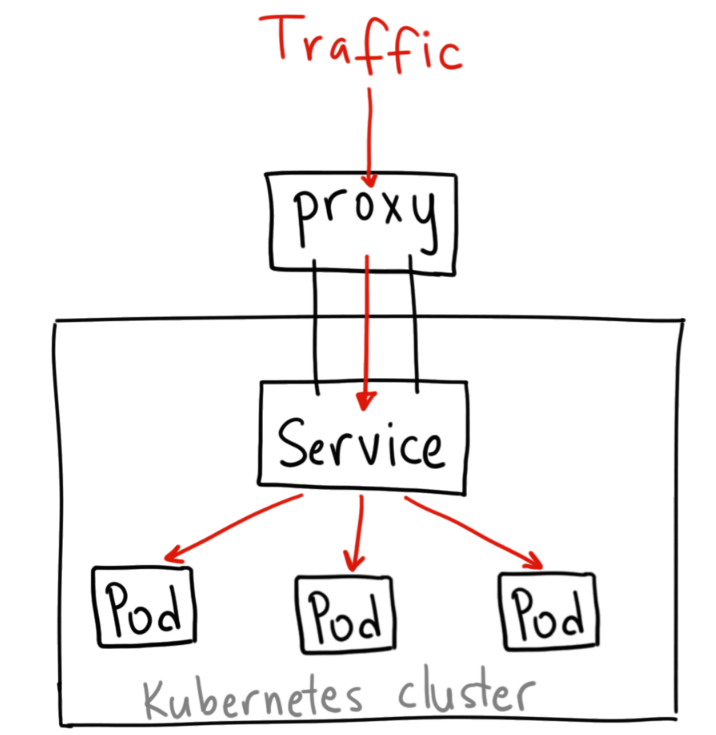
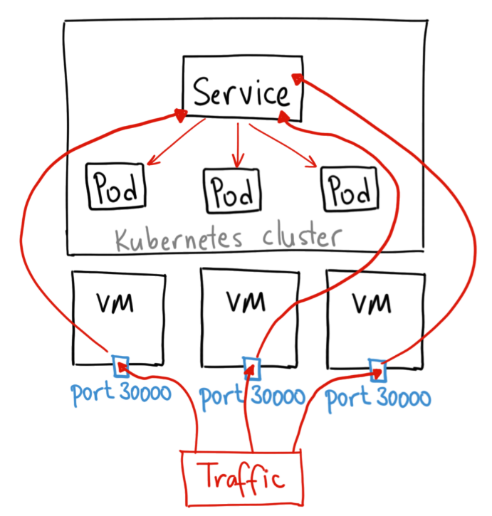
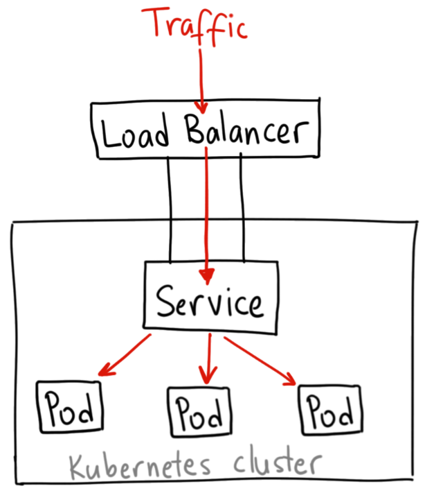

# SERVICES 101

## Requisitos

`git clone https://github.com/vthot4/kubernetes_101_lab.git`{{execute}}

`cd kubernetes_101_lab/`{{execute}}

`chmod +x environment.sh`{{execute}}

`./environment.sh`{{execute}}

`cd`{{execute}}

Comprobamos que todo esta correcto:

`minikube status`{{execute}}

Abrimos Octant. Para acceder, seleccionaos en la parte superior del terminal web, pulsar sobre el signo mas y luego pulsar en "Select port to view on Host 1". Escribir 8900, y luego pulsar "Display Port".

## Introducción

Un servicio de Kubernetes es un recurso que crea para crear un único punto de entrada constante a un grupo de Pods que proporcionan el mismo servicio. Cada servicio tiene una dirección IP y un puerto que nunca cambian mientras el servicio existe. Los clientes pueden abrir conexiones a esa IP y puerto, y esas conexiones se enrutan a uno de los Pods que respaldan ese servicio. De esta manera, los clientes de un servicio no necesitan conocer la ubicación de los Pods individuales que brindan el servicio, lo que permite que esos Pods se muevan alrededor del clúster en cualquier momento.

### Tipos de Servicios.

- **ClusterIP.** Sólo permite el acceso interno entre distintos servicios. Es el tipo por defecto. Podemos acceder desde el exterior usando *kubectl proxy*. Este tipo de servicio no debe usarse para exponer servicios de producción. Sin embargo se puede usar para:

  - Pruebas de integración entre servicios.
  - Acceder a servicios internos que exponen datos no relacionados con el negocio. (EJ.: Monitorización )

  La forma en que va la solicitud es la siguiente: Tráfico --> proxy k8s --> servicio K8s (Cluster IP) -> Pods.

  

- **NodePort.** Nos abre un puerto, para que el servicio sea accesible desde el exterior. Pod defecto, el puerto generado está en el rango de 30000:40000. Para acceder usamos la IP del servidor master del clúster y el puerto asignado. La forma en que se realiza la solicitud es la siguiente: tráfico -> puerto expuesto en la máquina -> servicio K8s (NodePort) -> pods y se muestra en la siguiente imágen:

  

- **LoadBalancer.** Este tipo sólo esta soportado en servicios de cloud público (GKE, AKS o AWS). El proveedor asignara un recurso de balanceo ed carga para el acceso a los servicios. si usamos un cloud privado, como OpenSatck necesitaremos un plugin para configurar el funcionamiento. La solicitud tiene la siguiente ruta: tráfico -> LoadBalancer -> Servicio K8s -> pods y se muestra en la siguiente imagen:

  