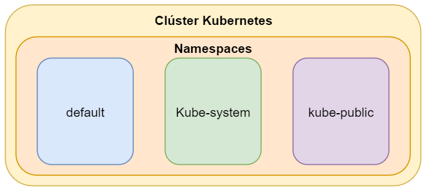

# Namespaces

## Requisitos

`git clone https://github.com/vthot4/kubernetes_101_lab.git`{{execute}}

`cd kubernetes_101_lab/`{{execute}}

`chmod +x environment.sh`{{execute}}

`./environment.sh`{{execute}}

`cd`{{execute}}

Comprobamos que todo esta correcto:

`minikube status`{{execute}}

Abrimos Octant. Para acceder, seleccionaos en la parte superior del terminal web, pulsar sobre el signo mas y luego pulsar en "Select port to view on Host 1". Escribir 8900, y luego pulsar "Display Port".

## Introducción

La mejor a proximación al concpeto de **namespace** puede ser pensar en que es un clúster virtual dentro del clúster de Kubernetes. Podremos tener múltiples namespaces dentro de un único cluster y todos están logicamente aislados los unos de los otros. Estos clústers virtuales nos pueden ayudar a diferenciar proyectos, equipos e incluso clientes dentro de un mismo clúster. También nos brinda la posibilidad de configurar restricciones entre los recursos.

Podemos obtener los namespaces que vienen por defecto en kubernetes mediante: 

`kubectl get namespace`{{execute}}

En la mayoría de las distribuciones de Kubernetes, el clúster de inicio por defecto esta dentro del Namespace "default". De hecho, hay tres namespaces con los que Kubernetes se crea: default, kube-system (utilizado para componentes de Kubernetes) y kube-public ( usado para recursos públicos). kube-public no se usa mucho actualmente.

- **Kube-system.** Este espacio de nomres tiene objetos creados por el sistema de Kubernetes. Podemos ver de que está compuesto mediante:

  `kubectl get pods -n kube-system`{{execute}}

  

- **kube-public.**  Este espacio de nombres se crea de forma automática y es legible por todos los usuarios (incluyendo aquellos no autenticados). Este espacio de nombres se reserva principalmente para uso interno del clúster, en caso de que algunos recursos necesiten ser visibles y legibles de forma pública para todo el clúster. La naturaleza pública de este espacio de nombres es simplemente por convención, no es un requisito. Este espacio de nombres tiene una ConfigMap que contiene el bootstrapping y el certificado de configuración para el clúster Kubernetes.

  `kubectl get pods -n kube-public`{{execute}}

  No veremos nada ejecutándose en este namespace, pero podemos ver la info del ConfigMap: 

  `kubectl get configmap -n kube-public cluster-info -o yaml`{{execute}}

  

- **default.** Todos los objetos creados sin especificar un espacio de nombres se crearán automáticamente en el defaultespacio de nombres.

  Este espacio de nombres está inicialmente vacío y no contiene ningún objeto:

  `kubectl get pods -n default`{{execute}}

  Una cosa a tener en cuenta sobre el defaultespacio de nombres es que no se puede eliminar, a diferencia de otros espacios de nombres dentro del clúster de Kubernetes.

