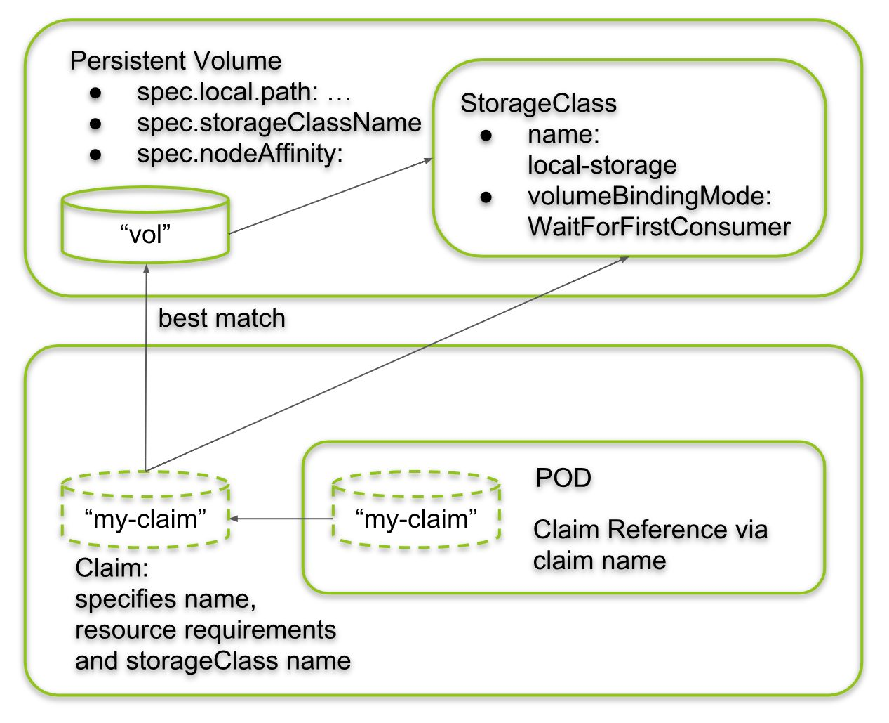

# Almacenamiento

## Requisitos

`git clone https://github.com/vthot4/kubernetes_101_lab.git`{{execute}}

`cd kubernetes_101_lab/`{{execute}}

`chmod +x environment.sh`{{execute}}

`./environment.sh`{{execute}}

`cd`{{execute}}

Comprobamos que todo esta correcto:

`minikube status`{{execute}}

Abrimos Octant. Para acceder, seleccionaos en la parte superior del terminal web, pulsar sobre el signo mas y luego pulsar en "Select port to view on Host 1". Escribir 8900, y luego pulsar "Display Port".

## Introducción

Como hemos comentado anteriormente los pods son efímero, la información guardada en ellos no es persistente, pero es evidentemente que necesitamos que nuestras aplicaciones tengan la posibilidad de que su información no se pierda. La solución es añadir volúmenes (almacenamiento persistente) a los pods para que lo puedan utilizar los contenedores. Los volúmenes son considerados otro recurso de Kubernetes.

Se encuentra disponible una amplia variedad de tipos de volumen. Varios son genéricos, mientras que otros son específicos de las tecnologías de almacenamiento reales utilizadas:

- **emptyDir:** Un directorio vacío simple que se utiliza para almacenar datos transitorios.                         
- **hostPath:** Se utiliza para montar directorios del sistema de archivos del nodo de trabajo en el pod.                           
- **gitRepo** Un volumen inicializado al verificar el contenido de un repositorio Git.                           
- **nfs** Un recurso compartido NFS montado en el pod.                           
- **gcePersistentDisk**(Disco persistente de Google Compute Engine), **awsElasticBlockStore**(Volumen del almacén de bloques elásticos de Amazon Web Services), **azureDisk**(Volumen de disco de Microsoft Azure): se utiliza para montar el almacenamiento específico del proveedor de la nube.                          
- **cinder, cephfs, iscsi, flocker, glusterfs, quobyte, rbd, flexVolume, vsphere-Volume, photonPersistentDisk, scaleIO** Se utiliza para el montaje de otros tipos de almacenamiento de red.                           
- **configMap, secret, downwardAPITipos**  Especiales de los volúmenes utilizados para exponer ciertos recursos Kubernetes e información del clúster al Pod.                           
- **persistentVolumeClaim:** Una forma de utilizar un almacenamiento persistente provisto de forma dinámica o previa.

