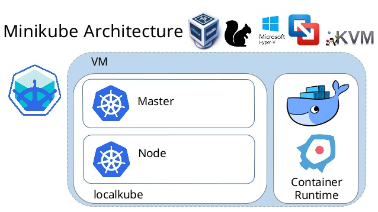

# Creando el  clúster de Kubernetes.

En este pequeño laboratorio vamos a ver los conceptos básicos de Kubernetes. Para ello vamos a utilizar **minikube**, una herramienta que nos permite desplegar un clúster de Kubernetes con un único nodo en una máquina virtual. 

Para evitar problemas con la instalación, hemos optado que estuviera instalado. Si queremos ver cual es el procedimiento de instalación en los diferentes entornos podemos recurrir a:

> https://kubernetes.io/es/docs/tasks/tools/install-minikube/

Para instalarlo en un entorno Linux, deberemos instalar previamente un hypervisor como  [KVM](http://www.linux-kvm.org/) o [Virtualvox](https://www.virtualbox.org/wiki/Downloads) y el interfaz de línea de comando de kubernetes: [kubectl](https://kubernetes.io/docs/tasks/tools/install-kubectl/) .  Una vez cumplidos estos requisitos podemos realizar la instalación de Minikube con:

``` bash
$ curl -Lo minikube https://storage.googleapis.com/minikube/releases/latest/minikube-linux-amd64 && chmod +x minikube 

$ sudo cp minikube /usr/local/bin && rm minikube
```

Minikube presenta las siguientes características:

- DNS
- NodePorts
- ConfigMAps and Secrets.
- Dashboards.
- Container Runtime: Docker, CRI-O, and containerd.
- Enabling CNI(Container Network Interface).
- Ingress.


## Empezamos a jugar con minikube.

Lo primero que tenemos que hacer es comprobar que minikube esta instalado y funciona correctamente:

`minikube version`{{execute}}

Comprobamos que tenemos la última versión de minikube:

`minikube check-update`{{execute}}

Si vemos que existe alguna versión superior lo actualizaremos de la siguiente forma:

`wget https://storage.googleapis.com/minikube/releases/latest/minikube-linux-amd64`{{execute}}

`chmod +x minikube-linux-amd64`{{execute}}

`sudo mv minikube-linux-amd64 /usr/local/bin/minikube`{{execute}}

Confirmamos la nueva versión:

`minikube version`{{execute}}

Podemos ver todos las posibilidades que nos ofrece:

`minikube `{{execute}}

Podemos ver algo más de información:

`minikube config view `{{execute}}

Y comprobamos que el demonio de docker se comunica con el demonio de docker dentro de la máquina virtual de minikube:

`docker ps `{{execute}}

Comprobado que minikube esta instalado y operativo, vamos a levantar el clúster mono-nodo:

`minikube start `{{execute}}

Si todo ha ido bien, deberíamos tener funcionando un clúster kubernetes en nuestra máquina. Minikube ha levantado una máquina virtual sobre el hypervisor donde ejecuta el clúster.

  

Podemos comprobar el estado de minikube mediante:

`minikube status `{{execute}}

Si todo va bien nos debería aparecer algo parecido a esto:

```bash
$ minikube status
host: Running
kubelet: Running
apiserver: Running
kubeconfig: Configured
```

Para revisar los logs de la ejecución usaremos *minikube logs*

 `minikube logs `{{execute}}


## Complementos de minikube

Minikube dispone de complementos que nos pueden ayudar a administrar el clúster de Kubernetes. Podemos ver la lista de los que dispone por defecto mediante:

 `minikube addons list `{{execute}}


## Parar y Borrar el clúster

Para parar el clúster usaremos la opción *stop*:

 `minikube stop `{{execute}}

Desde el punto de vista técnico simplemente estamos parando la máquina virtual, si quisiéramos borrarlo bastaría con:

`minikube delete `{{execute}}


## Modificando el arranque por defecto

Debemos fijarnos que hemos levantando el entorno por defecto, si queremos proporcionarle más memoria o cpu podemos añadir los siguientes parámetros:

```bash
 minikube start --cpus 4 --memory 8192
```

También podemos cambiar el runtime a utilizar, por ejemplo seleccionado ***CRI-O***

```bash
minikube start \
    --network-plugin=cni \
    --enable-default-cni \
    --container-runtime=cri-o \
    --bootstrapper=kubeadm
```


Podemos encontrar más información en: https://kubernetes.io/docs/setup/learning-environment/minikube/