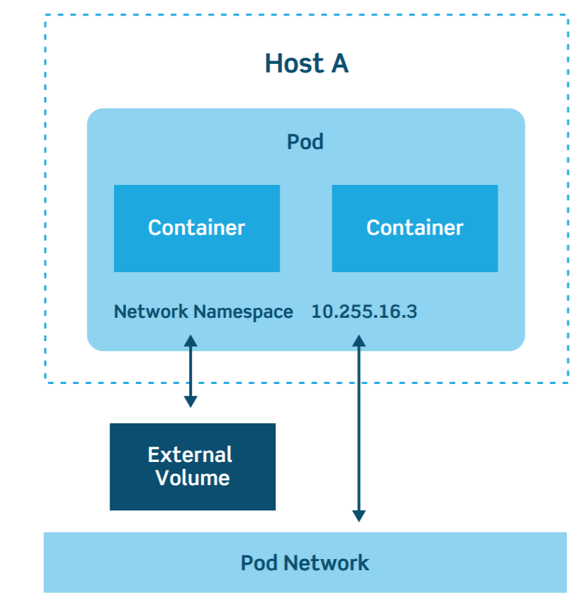
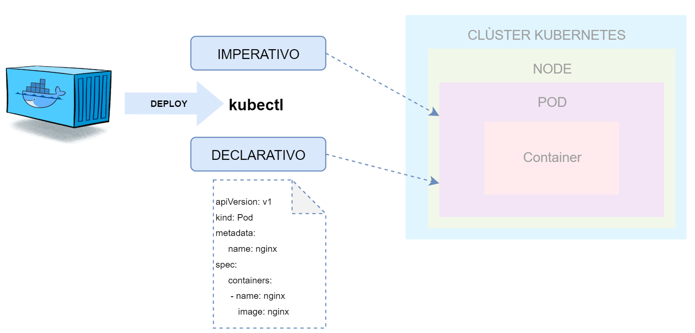

# PODS 101. Introducción.

## ¿Qué es un Pod?

Los **Pods** son unos de los conceptos más importantes en Kubernetes, ya que son los objetos claves con los que interactúan los desarrolladores.  Un Pod será la unidad de ejecución básica de una aplicación Kubernetes, la unidad más pequeña y simple en el modelo de objetos que crea o implementa Kubernetes. El Pod encapsula el contenedor (ó contenedores) de una aplicación junto con los recursos de almacenamiento, red y las reglas de ejecución.   

El diagrama de arquitectura de un Pod queda reflejado en el siguiente esquema:

Una característica interesante de los Pods es que son efímeros, con una vida útil normalmente limitada. Al reducir el escalado o actualizar a una nueva versión, los Pods mueren. Es una idea que tenemos que tener clara, cuando un Pod falla o cambia, todo lo que contenía desaparece por lo que nos debemos de apoyar en herramientas externas para poder hacer análisis de *"root cause"* .

Existen dos tipos de modelos de Pod que podemos crear:

- **Un contenedor por Pod.**  Es el modelo habitual y nos proporciona un alto desacoplamiento de los diferentes servicios por lo menos a nivel operacional.
- **Multi-contenedor por Pod.** En este modelo, un Pod puede contener múltiples contenedores que suelen estar estrechamente acoplados para compartir recursos. Estos contenedores funcionan como una sola unidad de servicio. Un ejemplo puede ser el uso de sidecars, proxies o registros.

A la hora de desplegar el Pod en el clúster de Kubernetes podemos optar por una vía imperativa en la que lo desplegamos directamente o declarativa mediante un fichero tipo **yaml** en el que le decimos al clúster como queremos que despliegue nuestro Pod. La primera opción suele estar bien para entornos de desarrollo pero no es buena opción para producción. 

## Nuestro primer Pod.

